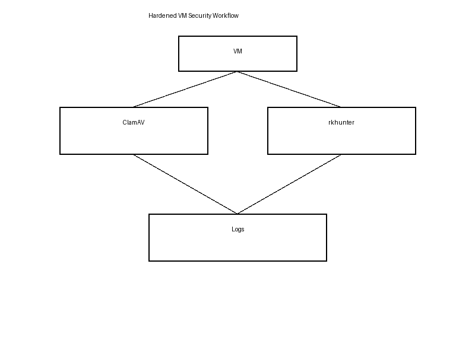

# Hardened VM Security Deployment


Enterprise-ready security hardening script for Linux virtual machines, combining **ClamAV** (on-demand and scheduled scans) and **Rootkit Hunter (rkhunter)** offline scanning. Designed for production servers behind NAT (non-internet-facing), supporting **Debian 13 (Trixie)** and common hypervisors: VMware, Proxmox, KVM.

---

## Features

- **ClamAV + ClamTk** (GUI optional)
  - On-demand and scheduled scans
  - Throttled with `nice` and `ionice` for performance-safe scanning
  - Quarantine directory at `/opt/quarantine`
  - Malware auto-removal option (`--remove=yes`) configurable
  - Excludes sensitive system directories (`/proc`, `/sys`, `/dev`, etc.)
- **Rootkit Hunter (rkhunter)**
  - Offline-safe, enterprise-mode configuration
  - Daily cron scans
  - Logs warnings via email
- **Log rotation**
  - Weekly rotation, keeps 8 compressed logs
- **Cron automation**
  - Daily ClamAV database updates
  - Daily ClamAV scans
  - Daily rkhunter scans
- **Hypervisor aware**
  - Custom excludes for VMware shared folders, Proxmox, and KVM environments
- **Interactive scan prompt**
  - At the end of the script, optionally run ClamAV and rkhunter immediately

---

## 🔒 Hardened VM Security Workflow



### Workflow Overview

1. **ClamAV**:
   - Updates virus definitions daily via `freshclam`.
   - Scans VM directories on-demand or via cron.
   - Moves infected files to `/opt/quarantine`.
   - Throttled with `nice` and `ionice` to avoid affecting production workloads.

2. **rkhunter**:
   - Offline scanning for rootkits, backdoors, and suspicious files.
   - Uses local mirrors (`mirrors.dat`) to avoid internet access.
   - Logs warnings and sends email notifications if issues detected.

3. **Logging & Alerts**:
   - Scan logs rotated weekly (`/var/log/security/`)
   - Email alerts to system administrator for infections or warnings.
   - Quarantine hardened with restricted permissions and optional immutable flag.

---

## Quarantine Directory

- Location: `/opt/quarantine`
- Permissions: `700` (root only)
- Optional immutable flag (`chattr +i`) applied when supported
- All infected files moved here automatically by ClamAV

---

## Logs

- Location: `/var/log/security/`
- Files:
  - `clamav_scan.log`
  - `rkhunter_scan.log`

---

## Installation & Usage

1. Clone the repository:

```bash
git clone https://github.com/<your-username>/hardened-vm-security.git
cd hardened-vm-security
chmod +x secure_vm_hardened.sh
sudo ./secure_vm_hardened.sh
Do you want to run a ClamAV and rkhunter scan now? (yes/no)

Cron Jobs
Task	Schedule	Script/File
ClamAV database update	Daily 03:00	freshclam --quiet
ClamAV scan	Daily 04:00	/usr/local/bin/vm_clamscan.sh
rkhunter scan	Daily 02:30	/usr/local/bin/vm_rkhunter.sh
Email Notifications

Root email receives scan logs

ClamAV:

Infection detected → email with scan log

Scan error → email with log

rkhunter:

Any warnings → email with log

Supported Platforms

Debian 13 (Trixie) — fully tested

RedHat-based systems — partial support, may require adjustments

Virtualization:

VMware

Proxmox

KVM

Security Considerations

Offline-safe rkhunter for NAT-only VMs

Hardened quarantine directory

CPU/IO throttled scans to avoid production impact

Only local mirrors for rkhunter

Cross-filesystem scans disabled for safety

Contributing

Contributions welcome! Please test on staging VMs before production deployment.
Standard GitHub PR workflow applies.

License

MIT License © 2026 FLASHINTELL.NET / Luis Silva
